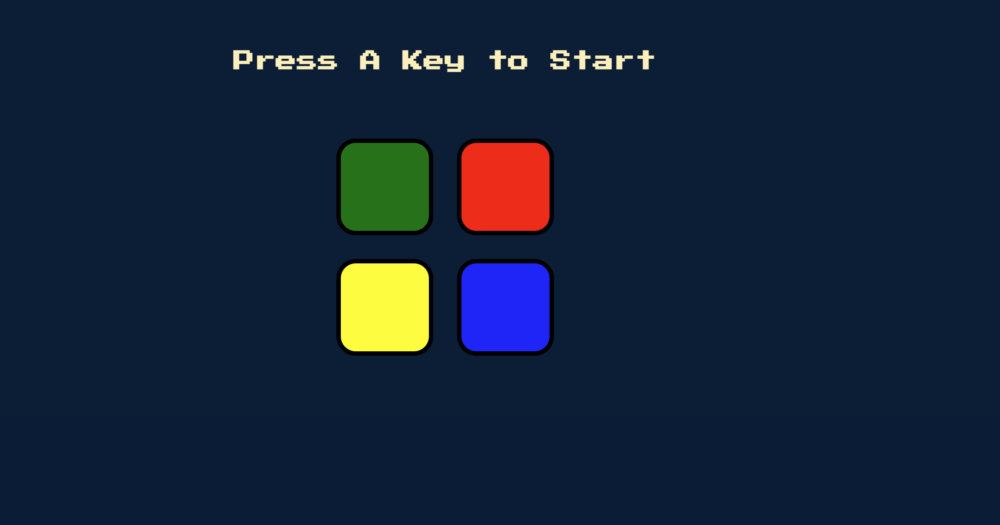

# Simon Game Web App

This is a web-based implementation of the classic Simon game. The game tests your memory and pattern recognition skills as you attempt to replicate increasingly complex sequences of colored buttons and tones.

## Features:

- Simple and intuitive user interface.
- Randomly generated sequences of colors and tones.
- Progressive difficulty with each successful round.
- Responsive design for optimal gameplay on desktop and mobile devices.

## Instructions:

- Press the "Start" button to begin the game.
- Pay attention to the sequence of colors and tones played by the game.
- Repeat the sequence by clicking the colored buttons in the correct order.
- If you make a mistake, the game will indicate the correct sequence and end the game.
- Successfully complete each round to progress to the next level and challenge yourself with longer sequences.

## Play the game 👇:
Link to live demo (Add the link to your live demo here)

## Technologies used:

- HTML
- CSS
- JavaScript
- jQuery
  
## Screenshots:

